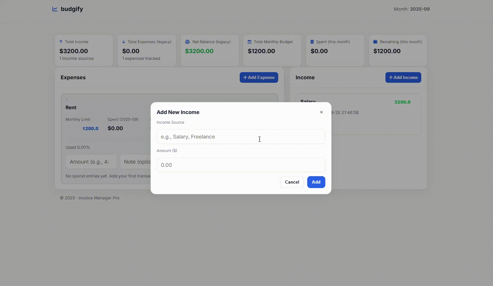

# Budgify — Invoice & Budget Tracker (Flask)

A minimalist but powerful personal finance dashboard to track **income**, **expense buckets**, **per-bucket monthly budgets**, and **real spend transactions**—with auto-computed status (Pending / In Course / Paid / Over), responsive UI, and inline edits.

**Demo (GIF)**



---

## Table of Contents

- [Budgify — Invoice \& Budget Tracker (Flask)](#budgify--invoice--budget-tracker-flask)
  - [Table of Contents](#table-of-contents)
  - [Features](#features)
  - [Screenshots \& Demo](#screenshots--demo)
  - [Quick Start](#quick-start)
    - [1) Clone \& create a virtual environment](#1-clone--create-a-virtual-environment)
    - [2) Install dependencies](#2-install-dependencies)
    - [3) Run](#3-run)
  - [Project Structure](#project-structure)
  - [Configuration](#configuration)
  - [How It Works](#how-it-works)
    - [Data Model](#data-model)
    - [Statuses \& Budget Logic](#statuses--budget-logic)
    - [UI/UX](#uiux)
  - [HTTP Routes (UI \& API)](#http-routes-ui--api)
  - [Data File \& Backups](#data-file--backups)
  - [Customization](#customization)
    - [Design Tokens (CSS)](#design-tokens-css)
    - [Renaming the App](#renaming-the-app)
  - [Deployment](#deployment)
  - [Troubleshooting](#troubleshooting)
  - [Roadmap](#roadmap)

---

## Features

- **Income & Expense Buckets**  
  Add multiple income sources and expense “buckets” (e.g., *Rent, Groceries, Internet*).

- **Monthly Budgets + Real Spend**  
  Each expense bucket can have a **monthly limit**. Add **transactions** with amount + note; Budgify aggregates spend **per current month**.

- **Auto Status & Budget State**  
  - *Pending* (nothing spent yet)  
  - *In Course* (spend < limit)  
  - *Paid* (spend == limit)  
  - *Over* (spend > limit)  
  Visual OK/Near/Over badges + progress bar per bucket.

- **Inline Editing**  
  Update **legacy cost**, **monthly limit**, and **income amounts** inline without leaving the page.

- **Modern, Responsive UI**  
  Inter font, subtle shadows, clear badges, keyboard-friendly inputs.

- **Zero Dependencies (beyond Flask)**  
  Pure Flask + standard library + one template file. Data persists in a single JSON file.

---

## Screenshots & Demo

- **Animated demo GIF:** place yours at `docs/demo.gif` and it will render above.
- (Optional) Add static screenshots in `docs/` and reference them here:

```
docs/
├─ demo.gif
├─ dashboard-1.png
└─ dashboard-2.png
```

---

## Quick Start

### 1) Clone & create a virtual environment

```bash
git clone <your-fork-url> budgify
cd budgify

# Python 3.10+ recommended
python -m venv .venv
# Windows:
.venv\Scripts\activate
# macOS/Linux:
source .venv/bin/activate
```

### 2) Install dependencies

```bash
pip install flask
```

*(Optional for production: `pip install waitress`)*

### 3) Run

```bash
python app.py
# -> serves http://localhost:5000 (debug=True)
```

Your data will be stored in `invoice_data.json` at the project root.

---

## Project Structure

```
budgify/
├─ app.py                    # Flask app (routes + one Jinja2 template writer)
├─ templates/
│  └─ dashboard.html         # Generated at first run; UI + CSS + JS inlined
├─ invoice_data.json         # Your data (created after first change or on start)
└─ docs/
   └─ demo.gif               # (Optional) Your animated demo
```

---

## Configuration

This project is intentionally **config-light**:

- **Port & debug**: set in `app.py` (`app.run(debug=True)`).  
- **Data file**: `invoice_data.json` at project root. Change the `DATA_FILE` constant if you prefer a different path.  
- **Fonts & Icons**: Inter (Google Fonts) + Font Awesome (CDN) are linked in the template.

---

## How It Works

### Data Model

The app persists a single JSON file with two top-level arrays:

```json
{
  "outcomes": [
    {
      "id": 1,
      "name": "Groceries",
      "cost": 0.0,
      "monthly_limit": 150.0,
      "status": "Pending",
      "date_added": "2025-09-25 20:12:01",
      "transactions": [
        { "id": 1, "amount": 34.50, "note": "Veggies", "date": "2025-09-25 20:20:10" },
        { "id": 2, "amount": 18.95, "note": "Bread",   "date": "2025-09-25 21:05:33" }
      ]
    }
  ],
  "incomes": [
    { "id": 1, "name": "Salary", "amount": 1800.0, "date_added": "2025-09-25 19:43:22" }
  ]
}
```

### Statuses & Budget Logic

- **Month boundary:** Spend aggregation is calculated for the **current year-month** (`YYYY-MM`) and includes any transaction whose `date` starts with that prefix.
- **Auto status** is computed from **(spent this month)** vs **(monthly_limit)**:

```text
if spent == 0                    -> Pending
elif limit == 0 and spent > 0    -> In Course
elif spent < limit               -> In Course
elif spent == limit              -> Paid
elif spent > limit               -> Over
```

- **Budget state (UI badges):**
  - `ok`   if usage < 70%
  - `near` if 70% ≤ usage ≤ 100%
  - `over` if usage > 100%
  - `no-limit` if limit = 0

### UI/UX

- **Summary cards**: income total, expense total, net balance, monthly budget, this month’s spend, remaining.  
- **Expense item**: Monthly Limit, Spent, Remaining, Status, Usage badge, progress bar.  
- **Inline edits**: change numbers and they persist via background POST + quick reload.  
- **Quick add transaction**: per-bucket form adds a spend entry with an optional note.

---

## HTTP Routes (UI & API)

| Route | Method | Body (x-www-form-urlencoded) | Returns | Purpose |
|------:|:------:|-------------------------------|:-------:|--------|
| `/` | GET | — | HTML | Main dashboard |
| `/add_outcome` | POST | `name`, `cost?`, `monthly_limit` | 302 → `/` | Create expense bucket |
| `/add_income` | POST | `name`, `amount` | 302 → `/` | Create income |
| `/add_transaction` | POST | `outcome_id`, `amount`, `note?` | 302 → `/` | Add spend entry to a bucket |
| `/delete_transaction/<outcome_id>/<txn_id>` | POST | — | 302 → `/` | Delete one spend entry |
| `/delete_outcome/<outcome_id>` | POST | — | 302 → `/` | Delete an expense bucket |
| `/delete_income/<income_id>` | POST | — | 302 → `/` | Delete an income |
| `/update_outcome_cost` | POST | `outcome_id`, `cost` | JSON | Update legacy cost |
| `/update_income_amount` | POST | `income_id`, `amount` | JSON | Update income amount |
| `/update_monthly_limit` | POST | `outcome_id`, `monthly_limit` | JSON | Update per-bucket budget |

**Examples (cURL):**

```bash
# Add an expense bucket
curl -X POST -d "name=Groceries&cost=0&monthly_limit=150" http://localhost:5000/add_outcome

# Add a spend transaction
curl -X POST -d "outcome_id=1&amount=34.50&note=Veggies" http://localhost:5000/add_transaction

# Update monthly limit for outcome_id=1
curl -X POST -d "outcome_id=1&monthly_limit=200" http://localhost:5000/update_monthly_limit
```

---

## Data File & Backups

- **Location:** `invoice_data.json`  
- **Backup:** Copy periodically (e.g., commit privately or store on cloud).  
- **Reset:** Stop app, delete `invoice_data.json`, restart (fresh state).

---

## Customization

### Design Tokens (CSS)

```css
:root {
  --bg:#f6f7f8; --surface:#ffffff; --text:#0f172a; --muted:#6b7280; --border:#e5e7eb;
  --primary:#2563eb; --accent:#f59e0b;
  --ok:#22c55e; --near:#f59e0b; --over:#ef4444; --pending:#9ca3af;
  --ok-bg:#ecfdf5; --near-bg:#fff7ed; --over-bg:#fef2f2; --pending-bg:#f4f5f7;
  --radius-lg:14px; --radius-md:12px; --radius-sm:10px;
  --shadow-md:0 8px 24px rgba(17,24,39,.06);
  --shadow-sm:0 2px 10px rgba(17,24,39,.06);
  --focus:0 0 0 3px rgba(37,99,235,.25);
}
```

### Renaming the App

- Change `<title>` and navbar text in `dashboard.html`.  
- Update repo name and README.

---

## Deployment

- **Dev:** `python app.py`  
- **Production (Waitress example):**

```bash
pip install waitress
python -c "from waitress import serve; import app; serve(app.app, host='0.0.0.0', port=8080)"
```

---

## Troubleshooting

- **Encoding issues**: ensure UTF-8.  
- **Data not updating**: check console / devtools.  
- **Template missing**: created automatically on first run.  
- **Port conflict**: change `app.run(...)` port.

---

## Roadmap

- [ ] CSV/Excel import & export  
- [ ] Past month view  
- [ ] Tagging transactions  
- [ ] SQLite backend  
- [ ] Multi-currency  
- [ ] Authentication

